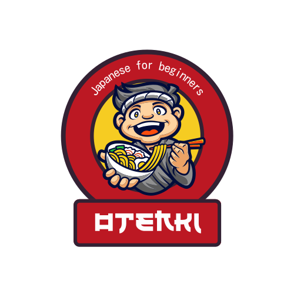

<div align="center">
    
</div>


# Otenki

Otenki is a Japanese-language learning app designed for beginners to the Japanese language. Designed to be used by absolute beginners, Otenki helps introduce users
to the foundational "Kana" writing systems in Japanese. Using this app, users have access to charts of the different characters and an interactive quiz that will test
their knowledge of the various characters.


## Built With

Front-End
* React.js
* JavaScript
* SASS

Back-End
* Express.js
* Node.js
* MySQL


## Features
* Fully responsive
* Learn page allows users to pick between learning Hiragana or Katakana writing systems
* Users can click on the "Toggle romaji" button to hide/show English "romaji" translations
* Select from 3 different quizzes: All characters, only Hiragana characters, or only Katakana characters
* Keeps track of the 5 most recent quiz scores


## Installation

Clone the repo 
   ```sh
   git clone git@github.com:karlmanto/Otenki.git
   ```

Create a .env file in the client directory using the .env.sample file as a guideline.  
Create a .env file in the server directory using the .env.example file as a guideline.

#### Server

1. cd into server directory
 ```sh
 cd server
 ```
2. Install NPM packages
 ```sh
 npm install
 ```
3. Create a MySQL database and run knex migrations and seeds to populate character data
 ```sh
 npx knex migrate:latest
 npx knex seed:run
 ```
4. Start the server
 ```sh
 node server.js
 ```
   
#### Client

1. cd into client directory
  ```sh
  cd client
  ```
2. Install NPM packages
  ```sh
  npm install
  ```
3. Start the client side
  ```sh
  npm start
  ```


## Next Steps

- [ ] Implement a point system to quizzes that rewards users with more points the quicker they can guess the answer
- [ ] Allow users to sign up and save their high scores
- [ ] Add Vocabulary section to Learn page
